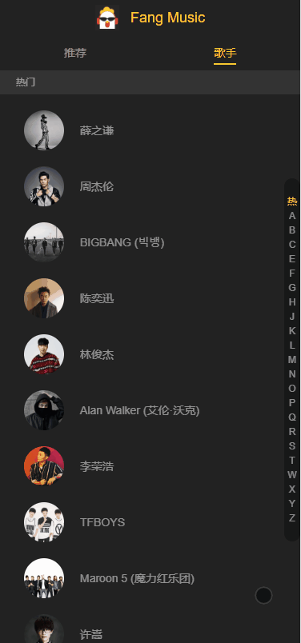
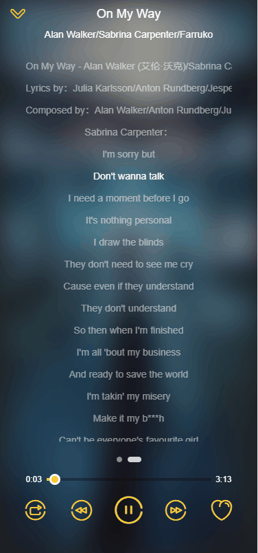
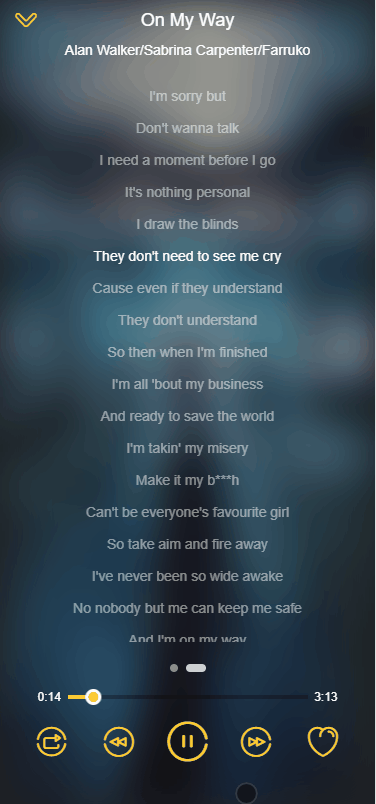

# F-Music
我的前端项目作品————一款清爽的音乐WebApp。

该项目原型来自《Vue.js权威指南》的一位知名的主要作者，**但本人独立的将该项目的全部JS部分用自己的代码复现了一遍。**

样式布局为Flex自适应布局。目前样式代码为Stylus编写，之后本人也将使用Sass复现样式。

核心技术栈： VueJS + Vuex + Vue-router + Webpack + 极少量JQuery + github上的一些开源工具 + 本人全力质量coding。(并没有使用Vue-cli，自己原生配置webpack)

开发状态：播放器内核已经开发完毕！

# 成果演示

